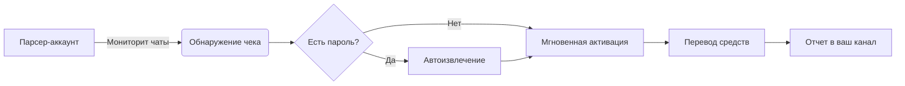

# 🚀 Автопарсер Telegram-чеков CryptoBot на Python + Telethon

**💻 Технологии**:  
Python • Telethon • OCR API (для обхода капчи)

**🔍 Описание**:  
Мощный инструмент для автоматического сбора и активации Telegram-чеков. Система использует два аккаунта для минимизации рисков:  
- **Парсер** мониторит чаты  
- **Активатор** мгновенно обрабатывает чеки  
Идеально настроенная скорость работы исключает бан аккаунтов и блокировки в чатах.

---

## ✨ Ключевые функции
- ⚡ **Мгновенная активация** чеков при появлении в чатах
- 🔑 **Автораспознавание паролей** (извлекает из текста вида "Пароль: 123")
- 🤖 **Обход капчи** через интеграцию с OCR-сервисом
- 💸 **Автовыплата** средств на указанный кошелек
- 📤 **Автоотправка** активированных чеков в ваш канал
- 🧹 **Чистка подписок**: автоматически отписывается от неактивных каналов (24ч без чеков)
- 🛡️ **Двухаккаунтовая система** - разделение парсера и активатора для безопасности

---

## ⚙️ Установка
1. Скачайте и распакуйте репозиторий
```bash
git clone https://github.com/kds_parser_cryptobot
.git
cd kds_parser_cryptobot

```
### 🖥️ Для пользователей Windows:
1. **Скачайте архив**:
   - Нажмите `Code` → `Download ZIP` вверху справа на GitHub
   - Распакуйте архив в удобное место (например, `C:\Projects\looter`)

2. **Установите Python**:
   - Скачайте установщик с [официального сайта](https://python.org/downloads)
   - **ВАЖНО**: при установке отметьте галочку ☑️ `Add Python to PATH`
   - Завершите установку

3. **Откройте терминал в папке проекта**:
   - Перейдите в распакованную папку
   - Кликните в адресную строку проводника → введите `cmd` → Enter  
   

4. **Установите зависимости**:
```cmd
pip install telethon regex requests
```

2. Установите зависимости:
```bash
pip install telethon regex requests
```

3. Настройте конфигурацию:
   - Откройте `config.py`
   - Введите данные для обоих аккаунтов:
     ```python
     # config.py — настройки аккаунтов для парсинга и активации чеков

     # Настройки API для парсера (первый аккаунт)
     api_id_parser =   # API ID для парсера от my.telegram.org
     api_hash_parser = ''  # API Hash для парсера

     # Настройки API для активатора (второй аккаунт)
     api_id_activator =   # API ID для активатора от my.telegram.org
     api_hash_activator = ''  # API Hash для активатора

     # Канал с логами об активации чеков
     channel = ''  # Канал для логов (без @). Укажите существующий канал

     # Автовывод средств через чек
     avto_vivod = True  # Если True — чек будет отправляться на указанный аккаунт раз в сутки
     avto_vivod_tag = ''  # Telegram username без @, куда будет идти перевод

     # Автоматическая отписка от неактивных каналов
     avto_otpiska = True  # Если True — скрипт будет отписываться от каналов без чеков за сутки

     # Поддержка капчи (если CryptoBot требует её)
     anti_captcha = True  # Если True — скрипт будет использовать OCR для обхода капчи

     # API ключ OCR сервиса (например, https://ocr.space/ или cap.guru)
     ocr_api_key = ''  # Ваш ключ API для распознавания капчи
     ```

---

## 🚀 Запуск
```bash
python main.py
```

**Процесс авторизации:**
1. Введите номер телефона **парсера** → код подтверждения → 2FA (если есть)
2. Повторите для **активатора**
3. Система начнет работу автоматически

---

## 🔧 Принцип работы


---

Мой Telegram: @KodoDrive
