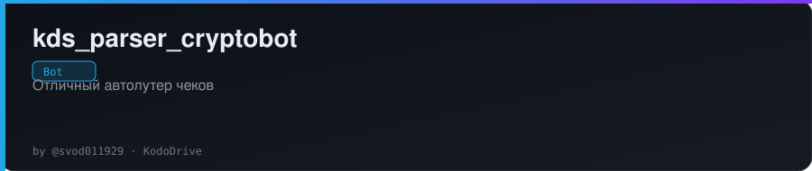
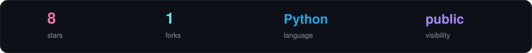

<!-- kododrive-readme-style -->

<div align="center">
  
</div>

<br/>

<div align="center">
  
</div>

<br/>

<p align="center">
  <a href="https://github.com/svod011929/kds_parser_cryptobot"></a>
  <a href="https://t.me/KodoDrive"></a>
  <a href="https://github.com/svod011929"></a>
</p>

<!-- /kododrive-readme-style -->

# 🚀 Автопарсер Telegram-чеков CryptoBot на Python + Telethon


<p align="center">
  
</p>

## 💻 Технологии

<table align="center">
  <tr>
    <td align="center" width="200">
      
      <br>
      <strong>Python</strong>
      <br>
      <span>Версия 3.12</span>
    </td>
    <td align="center" width="200">
      
      <br>
      <strong>Telethon</strong>
      <br>
      <span>Асинхронный API</span>
    </td>
    <td align="center" width="200">
      
      <br>
      <strong>OCR API</strong>
      <br>
      <span>Распознавание капчи</span>
    </td>
  </tr>
</table>

## 🔍 Описание
Автоматический инструмент для сбора и активации Telegram-чеков с использованием двух аккаунтов для максимальной безопасности:

- **Парсер** непрерывно мониторит чаты
- **Активатор** мгновенно обрабатывает найденные чеки

Оптимизированная скорость работы предотвращает блокировки аккаунтов и ограничения в чатах.

## ✨ Ключевые функции
- ⚡ Мгновенная активация чеков при появлении
- 🔑 Автоматическое распознавание паролей
- 🤖 Интеграция с OCR-сервисами для обхода капчи
- 💸 Ежедневный автовывод средств
- 📤 Автоматические отчеты в ваш канал
- 🧹 Самоочистка от неактивных каналов
- 🛡️ Разделение функционала между двумя аккаунтами

---

## ⚙️ Установка и настройка

### Для сервера Ubuntu
```bash
# Скачать и запустить установщик
wget https://raw.githubusercontent.com/svod011929/kds_parser_cryptobot/main/installer.sh
chmod +x installer.sh
./installer.sh
```
📌 *Установщик автоматически выполнит:*
- _Установку Python 3.12_
- _Инсталляцию зависимостей_
- _Настройку конфигурационного файла_

### Для Windows
1. **Скачайте архив проекта**  
   Нажмите `Code` → `Download ZIP` вверху справа на GitHub

2. **Установите Python 3.12**  
   - Скачайте [официальный установщик](https://python.org/downloads)
   - **Обязательно:** Отметьте ☑️ `Add Python to PATH`

3. **Откройте терминал в папке проекта**  
   - Распакуйте архив (например, в `C:\Projects\cryptobot`)
   - Перейдите в распакованную папку
   - В адресной строке проводника введите `cmd` и нажмите Enter

4. **Установите зависимости**  
```cmd
pip install telethon regex requests
```

5. **Настройте конфигурационный файл**  
   Откройте файл `config.py` и заполните по примеру:
   ```python
   api_id_parser = 1234567
   api_hash_parser = 'ваш_api_hash'
   api_id_activator = 7654321
   api_hash_activator = 'ваш_api_hash'
   channel = 'ваш_канал_логов'
   avto_vivod_tag = 'ваш_username'
   ocr_api_key = 'ваш_ключ_ocr'
   ```

---

## ⚡ Запуск программы
```bash
python main.py
```
[Пример работы](https://prnt.sc/krJYd3i9JAG7)

---

## ⚠️ Требования перед запуском
1. Два активных Telegram-аккаунта
2. API-ключи с [my.telegram.org](https://my.telegram.org)
3. Ключ для OCR-сервиса (рекомендуем [cap.guru](https://cap.guru) или [ocr.space](https://ocr.space/))

---

## 📄 Пример полной конфигурации
```python
# config.py — обязательные настройки

# Парсер (первый аккаунт)
api_id_parser = 1234567
api_hash_parser = 'a1b2c3d4e5f6g7h8i9j0'

# Активатор (второй аккаунт)
api_id_activator = 7654321
api_hash_activator = '0j9i8h7g6f5e4d3c2b1a'

# Канал для логов (без @)
channel = 'crypto_logs_channel'

# Автовывод средств
avto_vivod = True  # Включить ежедневный вывод
avto_vivod_tag = 'my_crypto_wallet'  # Ваш username

# Автоотписка от неактивных каналов
avto_otpiska = True

# Обход капчи
anti_captcha = True
ocr_api_key = '123abc456def789ghi'  # Ваш OCR API ключ
```

---

## 🌟 Поддержка и сотрудничество

<div align="center">
  
### ✨ Свяжитесь со мной

[](https://t.me/KodoDrive)
[](mailto:bussines@kododrive-devl.ru)

</div>

<div align="center">
  <table>
    <tr>
      <td align="center" width="140">
        
        <br><strong>Поддержка</strong>
      </td>
      <td align="center" width="140">
        
        <br><strong>Сотрудничество</strong>
      </td>
      <td align="center" width="140">
        
        <br><strong>Настройка</strong>
      </td>
    </tr>
  </table>
</div>

<div align="center" style="margin-top: 20px; font-size: 1.2rem;">

📬 **Telegram:** [@KodoDrive](https://t.me/KodoDrive)  
⏳ Отвечаю в течение 24 часов  
💼 Деловые предложения: bussines@kododrive-devl.ru

</div>

<p align="center">
  
</p>

<p align="center">
  
</p>

---

<!-- kododrive-projects-block -->

## Проекты KodoDrive

Другие проекты автора: [профиль @svod011929](https://github.com/svod011929) · [Telegram](https://t.me/KodoDrive)

### VPN и инфраструктура

- [BuryatVPN — VPN-сервис + Telegram](https://github.com/svod011929/buryatvpn)
- [VPN Server Installer — VLESS + TLS](https://github.com/svod011929/vpn-server-installer)
- [3X-UI Auto Installer](https://github.com/svod011929/3x-ui-auto-installer)
- [AWG Bot Installer — AmneziaWG](https://github.com/svod011929/awg-bot-installer)
- [RemnaShop Installer](https://github.com/svod011929/remnashop-installer)
- [VPN Auto Installer — панели](https://github.com/svod011929/vpn-auto-installer)
- [VPNHubBot — Telegram VPN-бот](https://github.com/svod011929/VPNHubBot)

### Telegram и автоматизация

- [KDS Server Panel — SSH из Telegram](https://github.com/svod011929/KDS_Server_Panel)
- [Telegram → VK Poster](https://github.com/svod011929/telegram-to-vk-poster)
- **KDS Parser CryptoBot** ← ты здесь
- [Auction Bot](https://github.com/svod011929/auction-bot)
- [Invest Bot](https://github.com/svod011929/invest-bot)
- [Crypto Check Bot](https://github.com/svod011929/crypto-check-bot)
- [KodoRefStarsBot](https://github.com/svod011929/KodoRefStarsBot)

### Магазины и финансы

- [KodoCashFlow](https://github.com/svod011929/KodoCashFlow)
- [Telegram Crypto Shop](https://github.com/svod011929/telegram-crypto-shop)
- [TalkProfit](https://github.com/svod011929/talkprofit)

### Сайты

- [KodoDrive Portfolio](https://github.com/svod011929/kododrive-portfolio)
- [kododrive.github.io](https://github.com/svod011929/kododrive.github.io)

<!-- /kododrive-projects-block -->
